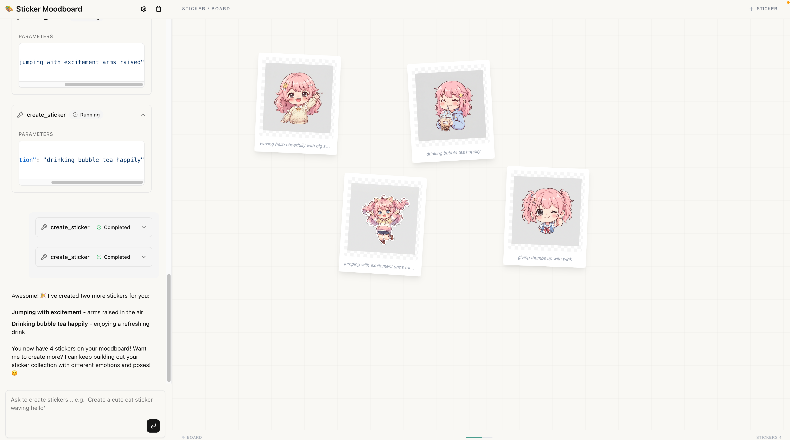

# Sticker Moodboard Agent



AI agent for creating LINE-style character stickers using Google Gemini's image generation. Features a chat-based interface on the left and a sticker moodboard canvas on the right.

## Features

- 🎨 **AI Sticker Generation** — Describe a pose/expression and the agent creates stickers via Google Gemini
- 🖼️ **Moodboard Canvas** — All generated stickers displayed in a grid with preview and download
- 💬 **Chat Interface** — Natural language conversation to create and manage stickers
- 🔑 **Frontend API Key Config** — Configure your Gemini API key directly in the browser

## Setup

### 1. Get a Gemini API Key

Go to [Google AI Studio](https://aistudio.google.com/apikey) and create an API key.

### 2. Install Dependencies

```bash
# Backend
deno install

# Frontend
cd ui && pnpm install
```

### 3. Run

```bash
# Option A: Run both together
deno task dev

# Option B: Run separately
deno task dev:api   # Backend on :8080
deno task dev:ui    # Frontend on :5173
```

### 4. Configure API Key

Open the app in your browser and click the ⚙️ Settings icon to enter your Gemini API key.

Or set it via environment variable:

```bash
export GEMINI_API_KEY="your-key-here"
```

## Architecture

```
├── main.ts              # Hono server entry point
├── api/
│   ├── mod.ts           # API routes (stickers, config, WebSocket)
│   ├── agent.ts         # Zypher Agent with Gemini model
│   └── config.ts        # Runtime config (API key store)
├── scripts/
│   └── create_sticker.ts  # Sticker generation script (Gemini API)
├── skills/
│   └── create-sticker/    # Agent skill definition
├── stickers/            # Generated sticker output (gitignored)
└── ui/                  # React frontend (Vite + Tailwind)
    └── src/
        ├── App.tsx                    # Main layout (chat + moodboard)
        ├── components/
        │   ├── StickerPanel.tsx       # Sticker moodboard grid
        │   ├── ApiKeyDialog.tsx       # API key configuration
        │   └── ai-elements/          # Chat UI components
        └── lib/zypher-ui/            # Agent SDK hooks
```

## How It Works

1. User describes a sticker in the chat (e.g., "Create a cute cat waving hello")
2. The agent uses the `create_sticker` skill to generate the image via Gemini
3. The sticker is saved to `stickers/` directory
4. The moodboard panel auto-refreshes via WebSocket to show the new sticker
5. Users can preview, download, or request variations

## Tech Stack

- **Backend**: Deno + Hono + Zypher Agent SDK
- **Frontend**: React 19 + Vite + Tailwind CSS 4
- **AI Model**: Google Gemini (chat + image generation)
- **Real-time**: WebSocket file watcher for live updates
